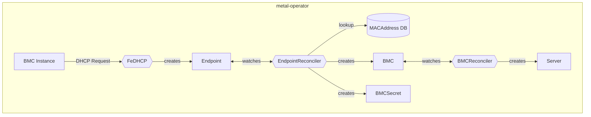
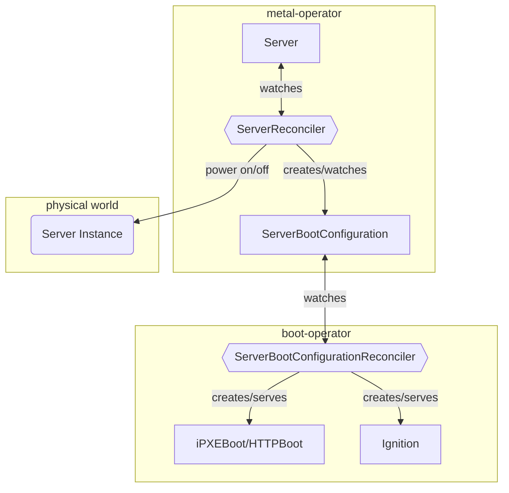

# Server Discovery and First Boot

This document describes the discovery and first boot process for bare metal servers in IronCore's baremetal automation.
The goal here is to provide a clear understanding of how bare metal servers are discovered and prepared for provisioning.

## Server Discovery 

The `metal-operator` supports two types of server discovery:
1. **DHCP-based discovery**: This method uses [FeDHCP](https://github.com/ironcore-dev/fedhcp) to discover servers based
on their DHCP requests. 
2. **BMC-based discovery**: This method uses the Baseboard Management Controller (BMC) to discover servers managed by a BMC.

### DHCP-based Discovery

The DHCP-based discovery process works as follows:



1. The BMC instance sends a DHCP request to the FeDHCP server.
2. FeDHCP creates an `Endpoint` resource based on the DHCP request.

Here is an example of an `Endpoint` resource:

```yaml
apiVersion: metal.ironcore.dev/v1alpha1
kind: Endpoint
metadata:
  name: device-12345
spec:
  macAddress: "00:1A:2B:3C:4D:5E"
  ip: 192.168.100.10
```

3. The `EndpointReconciler` watches for changes to the `Endpoint` and looks up the MAC address in the [MACAddress database](https://ironcore-dev.github.io/metal-operator/concepts/endpoints.html#configuration)
to find a matching MAC address prefix end derive from that the initial credentials, protocol, and other information needed to create a BMC resource.
4. If a MAC address prefix is found in the database, the `EndpointReconciler` creates a `BMC` and `BMCSecret` resource.

Here is an example of a `BMC` resource:

```yaml
apiVersion: metal.ironcore.dev/v1alpha1
kind: BMC
metadata:
  name: my-bmc
spec:
  endpointRef:
    name: my-bmc-endpoint
  bmcSecretRef:
    name: my-bmc-secret
  protocol:
    name: Redfish
    port: 8000
    scheme: http
  consoleProtocol:
    name: SSH
    port: 22
```

5. The `BMCReconciler` watches for changes to the `BMC` resource and creates a `Server` resource based on the BMC information.

Here is an example of a `Server` resource:

```yaml
apiVersion: metal.ironcore.dev/v1alpha1
kind: Server
metadata:
  name: my-server
spec:
  uuid: "123e4567-e89b-12d3-a456-426614174000"
  power: "Off"
  bmcRef:
    name: my-bmc
```

### BMC-based Discovery

The BMC-based discovery process works similar to the DHCP-based discovery, but here a `BMC` resource is created directly by
a user or an external system. 

An example of a `BMC` resource using inline access credentials is as follows:

```yaml
apiVersion: metal.ironcore.dev/v1alpha1
kind: BMC
metadata:
  name: my-bmc-inline
spec:
  access:
    macAddress: "00:1A:2B:3C:4D:5E"
    ip: "192.168.100.10"
  bmcSecretRef:
    name: my-bmc-secret
  protocol:
    name: Redfish
    port: 8000
  consoleProtocol:
    name: SSH
    port: 22
```

The rest of the process is the same as in the DHCP-based discovery.

## Discovery Boot

The first boot process (discovery boot) is triggered when a `Server` resource is created and is in the `Initial` state.
That will cause the `ServerReconciler` to initialize the first boot process which looks like this:



1. The `ServerReconciler` creates for every `Server` resource which is in the `Initial` state a [`ServerBootConfiguration`](https://ironcore-dev.github.io/metal-operator/concepts/serverbootconfigurations.html).
An example of a `ServerBootConfiguration` resource is as follows:

```yaml
apiVersion: metal.ironcore.dev/v1alpha1
kind: ServerBootConfiguration
metadata:
  name: my-server-boot-config
  namespace: defauilt
spec:
  serverRef:
    name: my-server
  image: my-osimage:latest
  ignitionSecretRef:
    name: my-ignition-secret
```

The key fields here are:
- `image`: The OS image to be used for booting the server. This image is configured in the `metal-operator` and expects a valid
IronCore [OCI OS image](/iaas/architecture/os-images).
- `ignitionSecretRef`: A reference to a Kubernetes secret that contains the Ignition configuration for the server. This Ignition
is generated by the `metal-operator` and contains in essence a [`metalprobe`](https://github.com/ironcore-dev/metal-operator/pkgs/container/metalprobe) 
image. `metalprobe` is an agent which is part of the `metal-operator` project that will be run on the server to extract 
additional information about the server. This image can also be configured in the `metal-operator`.

2. The `boot-operator` watches for changes to the `ServerBootConfiguration` resource and ensures the following: 
   - It creates an iPXE or HTTP boot configuration based on the `ServerBootConfiguration`.
   - It serves the boot configuration via HTTP and is presented to the server via DHCP.
   - It serves the necessary Ignition files for the server to boot and configure itself.
As soon as everything is ready to be served, the `boot-operator` will set the status of the `ServerBootConfiguration` to `Ready`.
   
3. `Server` with a `spec.Power` set to `On` and a `ServerBootConfiguration` in `Ready` state will trigger the server to boot.
   - The server will boot using the iPXE or HTTP boot configuration served by the `boot-operator`.
   - The server will then apply the Ignition configuration and start the `metalprobe` image to gather additional information about the server.
   - The `metalprobe` will report to a [registry endpoint](https://github.com/ironcore-dev/metal-operator/tree/main/internal/registry) the
extracted information about the server, which will be used by the `ServerReconciler` to update the `Server` status information and set the `Server`
state to `Available` if all expected information is available.

Once the discovery and first boot process is completed, the `Server` resource will be in the `Available` state and 
ready for further operations like provisioning custom software on it.
