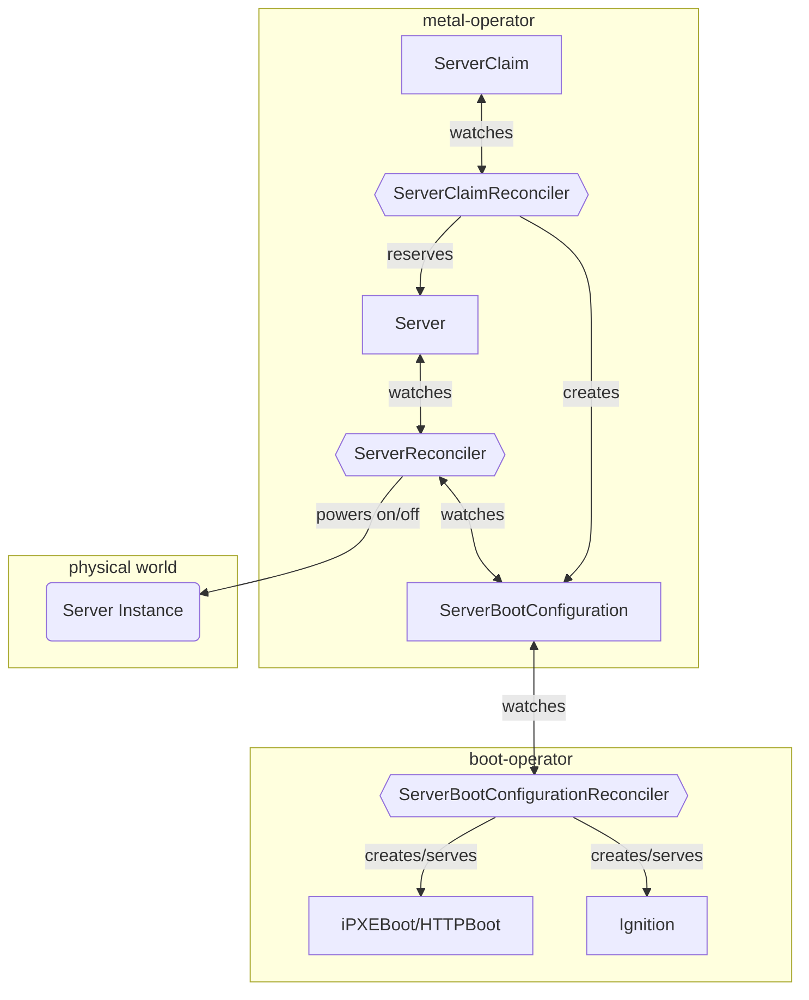

# Server Provisioning

This section describes how the provisioning of bare metal servers is handled in IronCore's bare metal automation. 
In the [discovery section](/baremetal/architecture/discovery) we discussed how servers are discovered and first time
booted and how they are transitioned into an `Available` state. Now we will focus on the provisioning process, and 
one can use such a `Server` resource to provision a custom operating system and automate the software installation on
such a server.

## Claiming a Server

The core concept in the provisioning process is the [`ServerClaim`](https://ironcore-dev.github.io/metal-operator/concepts/serverclaims.html) resource.

An example of a `ServerClaim` resource is as follows:

```yaml
apiVersion: metal.ironcore.dev/v1alpha1
kind: ServerClaim
metadata:
  name: my-server-claim
  namespace: default
spec:
  power: "On"
  serverRef:
    name: "my-server"
  image: "my-osimage:latest"
  ignitionSecretRef:
    name: "my-ignition-secret"
```

This example directly references a `Server` resource by providing the `serverRef` field. You can also dynamically claim
a server by providing a label selector in the `spec.serverSelector` field, which will match a `Server` resource.

In both cases, only `Servers` in an `Available` state can be claimed. 

## Provisioning Flow

The provisioning flow looks like this:



1. The `ServerClaimReconciler` watches for `ServerClaim` resources and reserves a `Server` resource by updating its state to `Bound` 
and transitions the `Server` from an `Available` state to a `Reserved` state.

2. The `ServerClaimReconciler` creates a `ServerBootConfiguration` resource for the claimed `Server`, which contains the boot image and Ignition configuration.
This process is similar to the `ServerBootConfiguration` created by the `ServerReconciler` for `Servers` in the `Initial` state.
Here however, the `ServerBootConfiguration` contains the operating system image and the Ignition configuration as specified in the `ServerClaim` resource.

3. The `boot-operator` watches the `ServerBootConfiguration` and creates and serves the necessary boot images and Ignition configurations.

4. The `ServerReconciler` watches the `ServerBootConfiguration` to become `Ready`, which indicates that the boot images and Ignition configurations are ready to be used.
Once that happens it ensures the power state as specified in the `ServerClaim` `spec.power` field.

The server will boot using the iPXE or HTTP boot configuration served by the `boot-operator`, start the specified operating system 
and apply the Ignition configuration.
