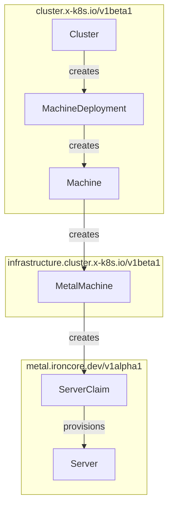

# Cluster API (CAPI) for IronCore Bare Metal

The [Cluster API (CAPI) for IronCore bare metal](https://github.com/ironcore-dev/cluster-api-provider-ironcore-metal) 
is a project that provides a declarative way to manage bare metal Kubernetes clusters using the Cluster API framework. 
It maps the CAPI concepts to the IronCore's `metal-operator` API types.

The diagram below illustrates the architecture of the Cluster API for IronCore bare metal:

