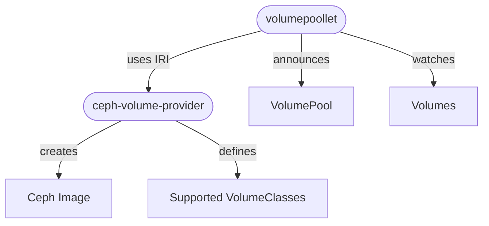
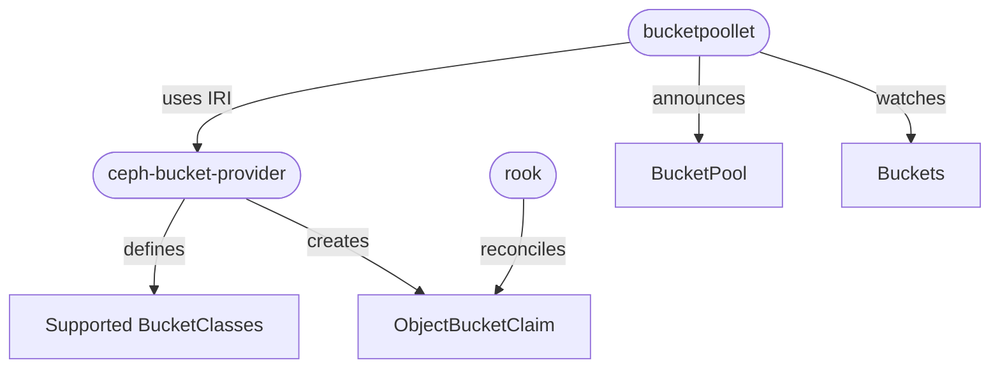

# `ceph-provider` 

The [`ceph-provider`](https://github.com/ironcore-dev/ceph-provider) contains two implementors of the 
[IronCore `VolumeRuntime`](/iaas/architecture/runtime-interface#volumeruntime-interface) interface:
- `ceph-volume-provider`: Implements the `VolumeRuntime` interface to manage volumes in a Ceph cluster.
- `ceph-bucket-provider`: Implements the `BucketRuntime` interface to manage object storage buckets in a Ceph cluster.

## `ceph-volume-provider`

The `ceph-volume-provider` implements the IronCore `VolumeRuntime` interface to manage volumes in a Ceph cluster. A 
`CreateVolume` IRI call results in the creation of a `ceph image` in the cluster, which can be used as a block device 
for virtual machines.

The following diagram visualizes the connection between the `ceph-volume-provider` and the `volumepoollet`:

Once a `Volume` has been created by the `ceph-volume-provider`, it returns the access information to the `volumepoollet`
which then propages this as status information to the `Volume` resource in the IronCore API. On the consumer side, e.g. 
[`libvirt-provider`](/iaas/architecture/providers/libvirt-provider), the `Volume` resource is then used to attach the 
block device to a virtual machine instance using the credentials provided in the `Volume` status.

## `ceph-bucket-provider`

The `ceph-bucket-provider` implements the IronCore `BucketRuntime` interface to manage object storage buckets in a Ceph cluster.
A `CreateBucket` IRI call results in the creation of a [`ObjectBucketClaim` (OBC)](https://github.com/kube-object-storage/lib-bucket-provisioner)
resource. In case of a [Rook](https://rook.io/) backed Ceph cluster, the corresponding `ObjectBucketClaim` is reconciled by Rook, which
will internally create a Ceph bucket and provide access credentials.

The following diagram visualizes the interplay of the different components:

The propagation of the access information to the `Bucket` resource in the IronCore API is similar to the `ceph-volume-provider` and
is done by the `bucketpoollet`. 
