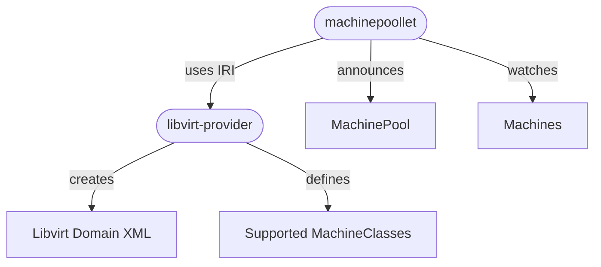

# `libvirt-provider`

The [`libvirt-proivder`](https://github.com/ironcore-dev/libvirt-provider) implements the 
[`MachineRuntime` interface](/iaas/architecture/runtime-interface#machineruntime-interface). It interfaces directly
with the `libvirt` daemon running on a hypervisor host to manage virtual machine instances.

In combination with the `machinepoollet` the `libvirt-provider` ensures the correct translation of `Machines` from the
IronCore `compute` resource group into a `domain.xml` representing the virtual machine on a physical host.

## Overview

The relationship beween the `machinepoollet` and the `libvirt-provider` is illustrated in the graph below:

Here the `machinepoollet` announces it's `MachinePool` and watches `Machines` scheduled on this pool as described in the
[Scheduling and Orchestration Section](/iaas/architecture/scheduling).

The `libvirt-provider` is then invoked by the `machinepoollet` via the `MachineRuntime` interface method the `libvirt-provider`
implements and creates/deletes/modifies virtual machine instances by interacting with the `libvirt` daemon.
