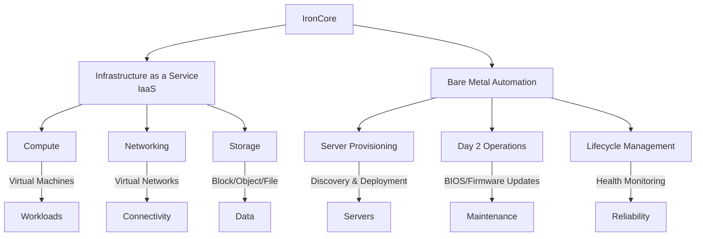

# Welcome to IronCore Documentation

IronCore is an open-source platform designed to empower users with robust infrastructure management and bare metal 
automation. Built with flexibility and scalability in mind, IronCore combines two powerful **layers** to streamline 
your computing needs: an **Infrastructure as a Service (IaaS)** layer and a **Bare Metal Automation** layer. Whether 
you're managing cloud-like resources or maintaining physical servers, IronCore has you covered.

## Overview

IronCore bridges the gap between virtualized infrastructure and physical hardware management, offering a unified 
solution for developers, system administrators, and enterprises. Explore the two core layers below to see how IronCore
can transform your workflows.

### IronCore Architecture

Here’s a visual representation of IronCore’s two layers:

---

### Infrastructure as a Service (IaaS)

The IaaS layer provides a flexible, user-friendly environment to create and manage **Compute**, **Networking**, and 
**Storage** resources. With IronCore, you can:

- **Compute**: Spin up virtual machines or containers tailored to your workload needs.
- **Networking**: Configure virtual networks, load balancers, and firewalls with ease.
- **Storage**: Provision scalable block, object, or file storage to suit your applications.

Designed for simplicity and power, this layer abstracts the complexity of resource management, giving you cloud-like 
control at your fingertips.

**[Get Started with IaaS](/docs/getting-started/iaas)** | **[API Reference](/components/ironcore/api-reference/overview/)**

---

### Bare Metal Automation

The Bare Metal Automation layer takes server management to the next level, handling everything from provisioning to ongoing maintenance. Key features include:

- **Server Provisioning**: Automate the discovery, configuration, and deployment of bare metal servers.
- **Day 2 Operations**: Simplify maintenance tasks like OS updates, BIOS/firmware upgrades, and hardware diagnostics.
- **Lifecycle Management**: Monitor and manage server health, ensuring peak performance and reliability.

This layer is perfect for those who need fine-grained control over physical hardware without sacrificing automation.

**[Bare Metal Setup Guide](/docs/getting-started/baremetal.md)** | **[API Reference](/components/metal-operator/api-reference/api/)**

---

## Why IronCore?

- **Open Source**: Fully transparent, community-driven, and free to use.
- **Dual-Layer Design**: Seamlessly integrate IaaS and bare metal management in one platform. Or use them independently.
- **Scalable**: From small deployments to enterprise-grade clusters, IronCore grows with you.

## Get Involved

- **[GitHub Repository](https://github.com/ironcore-dev)**: Explore the code, report issues, or submit pull requests.
